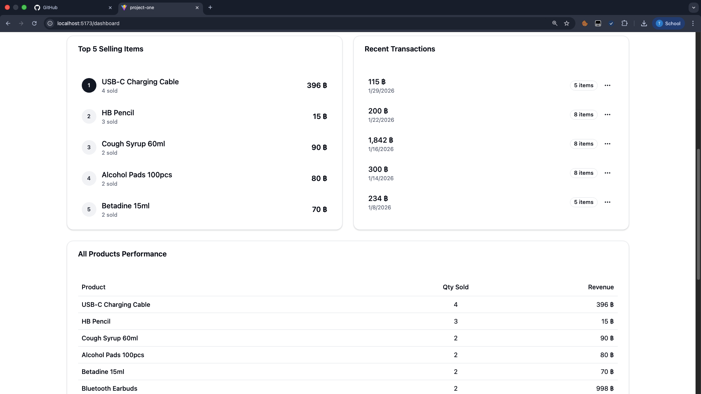
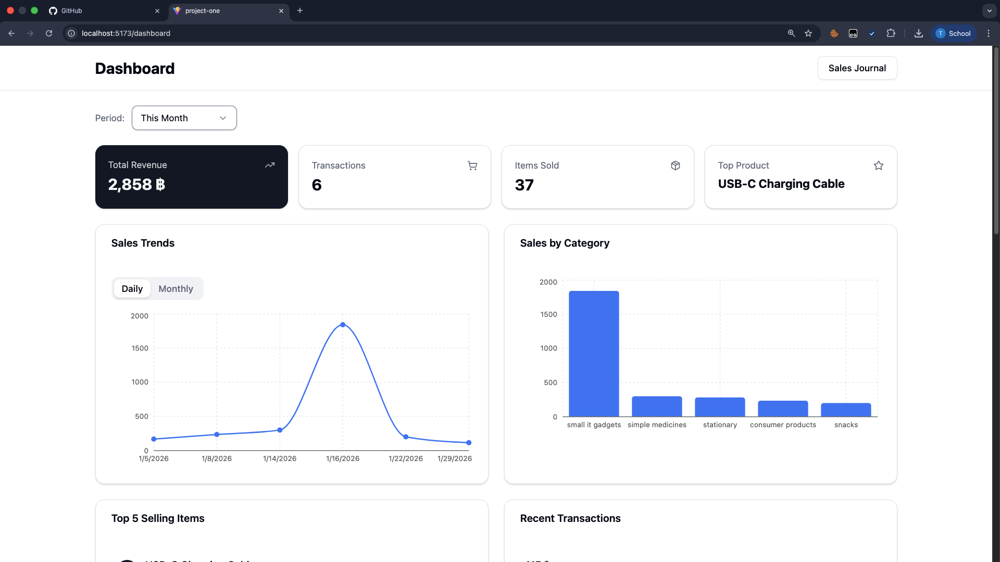
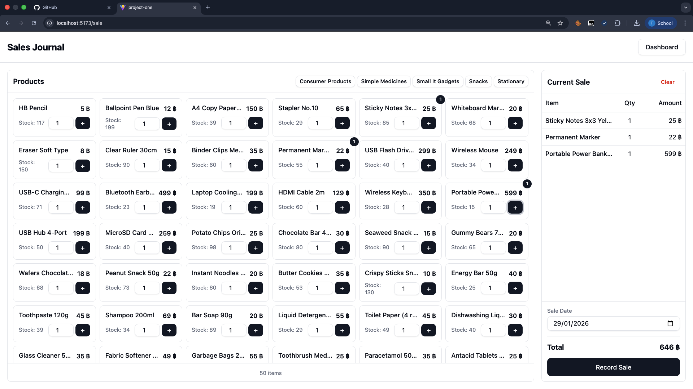

## Team Members

| Name  
| ----------------------
| **Hein Oke Soe**  
| **Thant Si Thu Naing**
| **Thant Zin Min**

# Basic POS System

A modern Point of Sale (POS) system built with React and Vite for managing sales, tracking inventory, and viewing business analytics.

## Screenshots

### Sales Dashboard



### Dashboard Analytics



### Sales Journal



## Features

- **Sales Dashboard** - View total sales, daily sales, and transaction counts
- **Sales Trends** - Visualize sales data over time with charts
- **Sales by Category** - Track performance across product categories
- **Top Best-Selling Items** - Identify your top 5 performing products
- **Sales Journal** - Browse products, manage cart, and complete sales
- **Product Search** - Filter products by name and category
- **Real-time Updates** - Instant cart calculations and stock tracking

## Tech Stack

- **Frontend**: React 18
- **Build Tool**: Vite
- **Styling**: CSS
- **Charts**: Chart.js / Recharts

## Getting Started

### Prerequisites

- Node.js (v18 or higher)
- npm or yarn

### Installation

1. Clone the repository

```bash
git clone https://github.com/GonChaung/csx4107-project-01-basic-pos
cd csx4107-project-01-basic-pos
```

2. Install dependencies

```bash
npm install
```

3. Start the development server

```bash
npm run dev
```

4. Open your browser and navigate to `http://localhost:5173`

## Course Information

- **Course**: CSX4107 - Web Application Development
- **Project**: Project 01 - Basic POS System

## License

This project is created for educational purposes as part of CSX4107 Web Application course.

---

<p align="center">Made with ❤️ by the team</p>
